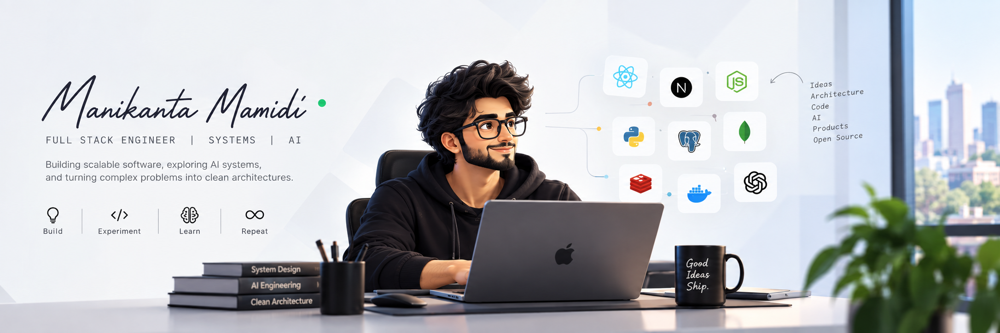

<div align="center">


# Manikanta Mamidi

### Full Stack Engineer · Systems · AI

**I build scalable software, explore AI systems, and enjoy turning messy problems into clean architectures.**

[🌐 Portfolio](https://mani-kanta.site)

</div>

---

## 👋 About Me

```text
Full Stack Engineer
├── Systems & Architecture
├── Backend & Distributed Systems
├── AI / LLM Applications
└── Always experimenting with something new
```

- 🧠 Interested in **system design, distributed systems, scalability & performance**
- 🤖 Exploring **LLMs, RAG, embeddings, agents & AI application architecture**
- ⚙️ I care more about **how systems behave at scale** than how impressive a demo looks
- 🧪 I like building weird things just to understand how they work
- 🌱 Currently going deeper into **distributed systems + LLM internals**
- 🔓 Gradually getting more involved in **open source**

---

## 🧩 My Stack

| Layer              | Technologies                                            |
| ------------------ | ------------------------------------------------------- |
| **Interface**      | React · Next.js · TypeScript · Tailwind                 |
| **Backend**        | Node.js · NestJS · Fastify · Express                    |
| **Data**           | MongoDB · PostgreSQL · MySQL · Redis                    |
| **Infrastructure** | Docker · Linux · Git · Turborepo                        |
| **AI**             | LLM APIs · RAG · Embeddings · Vector Search · AI Agents |
| **Languages**      | TypeScript · JavaScript · Python                        |

---

## ⚡ How I Think

> **Performance is a feature.**

> **AI is another layer of software engineering — not magic.**

> **Good architecture makes complex systems easier to reason about.**

> **If the problem is messy, make the architecture less messy.**

---

## 🔬 Currently Exploring

**LLM Internals** · **Transformers** · **Inference** · **AI Agents** · **Tool Use** · **Distributed Systems** · **System Design**

---

## 📊 GitHub

<div align="center">


</div>

---

## 🛠️ Open Source

Most of my interesting work currently lives in private repositories.

I'm gradually moving toward contributing more of my experiments and ideas to **open source**.

---

<div align="center">

### If you're building something difficult, let's talk.

**Systems · AI · Architecture · Interesting Problems**

[🌐 -](https://www.mani-kanta.site)

</div>
